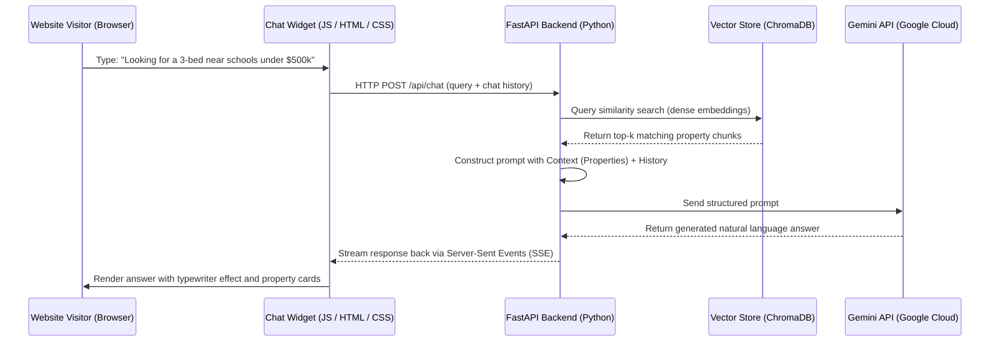

# 🏠 Real Estate AI RAG Chatbot

An interview-ready, full-stack **Retrieval-Augmented Generation (RAG)** chatbot designed for real estate websites. This bot searches through custom property listings (such as location, price, description, and features) and answers visitor queries using relevant property suggestions with citations.

---

## 🛠️ System Architecture



---

## 💻 Tech Stack

*   **Frontend:** Vanilla JavaScript, HTML5, CSS3 (Glassmorphic UI, responsive widget)
*   **Backend:** Python 3.10+, FastAPI (Asynchronous API framework)
*   **AI/RAG Orchestration:** LangChain / Official Google GenAI SDK
*   **Vector Database:** ChromaDB (Local vector storage)
*   **LLM Provider:** Google Gemini API (Gemini 2.0 Flash)

---

## 📁 Project Directory Structure

```text
ai-chatbot-py/
│
├── backend/                  # Python FastAPI API & RAG logic
│   ├── main.py               # API endpoints
│   ├── ingest.py             # Data ingestion and vectorization script
│   └── database/             # Vector database files (gitignored)
│
├── frontend/                 # Chatbot UI widget
│   ├── index.html            # Standalone test page (sandbox)
│   ├── widget.js             # Chatbot UI controller
│   └── widget.css            # Stylesheets (glassmorphic theme)
│
└── data/                     # Data source files
    └── properties.json       # Mock property database
```

---

## 🚀 Future Roadmap (30-Day Commit Schedule)
1. **Week 1:** Setup, Data Ingestion, Chunking, and Vector DB embedding.
2. **Week 2:** Dense & Sparse hybrid retrieval, prompt engineering, and memory.
3. **Week 3:** FastAPI server integration, validation, and streaming responses.
4. **Week 4:** JavaScript chat widget UI, styling, and streaming rendering.
5. **Week 5:** WordPress integration wrapper and deployment documentation.
